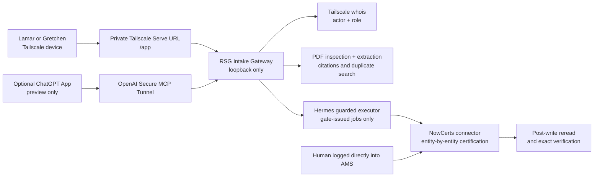

# RSG Intake Gate — Tailscale architecture

## Decision

There is **no Microsoft OAuth and no application login**. The gateway runs on one always-on RSG device and the operator website is reachable only through a private Tailscale Serve URL. Do not enable Tailscale Funnel.

### One automated way in

The RSG Intake Gate is the **only authorized entry point for automated NowCerts writes**. Hermes may execute an approved operation, but it must accept only a fingerprinted, identity-bound job created by this gate. Slack approvals, standalone Hermes commands, scheduled scripts, n8n workflows, ChatGPT tools, MCP tools, and other integrations may collect evidence or prepare previews; they may not independently create, update, import, archive, or deactivate NowCerts records.

The sole bypass is an intentional manual change made by a human who logs directly into the NowCerts/Momentum AMS. Manual AMS changes are legitimate concurrent activity. The gate must reread the target immediately before every commit, stop on overlapping changes, preserve unrelated changes, and require a new preview when the AMS record changed after approval.

Writer credentials must be available only to the final guarded executor. That executor rejects any job missing the gate-issued proposal ID, immutable payload fingerprint, verified operator identity, fresh explicit confirmation, verified write contract, approval timestamp, and idempotency key. No job is complete until the saved record has been read back and every intended field compared.

ChatGPT cannot directly connect to a private `*.ts.net` address because the MCP request originates from OpenAI infrastructure, not from Lamar's or Gretchen's tailnet device. If the embedded ChatGPT interface is retained, OpenAI Secure MCP Tunnel provides the transport to the private MCP server. That ChatGPT surface remains **preview-only**. Final approval occurs on the Tailscale operator page, where the request's tailnet device identity can be resolved.

## Trust boundaries



Tailscale is both the network boundary and the operator-identity source for the private website. The gateway maps the request source IP through Tailscale LocalAPI `whois` to either Lamar or Gretchen. Unknown or unmapped tailnet members are rejected.

The tunneled ChatGPT connection cannot use source-IP `whois` to distinguish Lamar from Gretchen: the gateway sees the local tunnel client. Therefore it may upload, extract, search, and prepare a proposal, but it may not perform final approval or a future live write.

## Permissions

| Tailnet identity | Role | Allowed after production certification |
| --- | --- | --- |
| Gretchen | Operator | Routine insured, contact, policy, vehicle, driver, and location creates/updates |
| Lamar | Admin | Operator actions plus carrier/master data, bulk operations, archive/deactivate, and overrides |

Before enabling approval:

1. Wire the existing Tailscale identity resolver to LocalAPI `whois` on the host.
2. Map exact tailnet login names to Lamar and Gretchen.
3. Remove `actor` and `approver` from production tool/request schemas.
4. Derive the actor and role only from the resolved tailnet identity.
5. Bind each approval to the proposal fingerprint, exact confirmation, device identity, and timestamp.
6. Reject requests that arrive through the tunnel or any unrecognized source for approval/write operations.

## PDF-to-AMS gate

1. The operator opens one client workspace and adds any combination of PDFs, pasted call/meeting transcripts, Apple Notes, and manually entered client facts.
2. The gateway enforces the 25 MB limit, verifies PDF structure, rejects encryption/corruption, performs malware scanning, hashes the bytes, and stores them with short retention.
3. Every source receives a stable source ID. OCR/model extraction emits only facts with a PDF page, transcript timestamp, or notes excerpt citation.
4. The synthesis stage reconciles all sources, surfaces contradictions, and identifies distinct business operations without guessing.
5. NAICS, SIC, GL, and WC candidates are accepted only after they are found in the RSG reference tables. NAICS drives classification.
6. The full risk assessment produces the underwriting summary, operations, coverage requirements, endorsements, red flags, favorable factors, missing items, evidence map, and confidence score.
7. Fields supported by verified NowCerts contracts are routed into an AMS preview. Operations narrative, research, unsupported fields, and the complete assessment remain in the retained PDF.
8. The gateway searches NowCerts for exact and likely duplicates and reads the current record before showing field-level changes.
9. Once the assessment is complete, the server creates a retained client PDF and exposes a Download button on the shared Tailscale page.
10. The operator explicitly confirms the fingerprinted AMS proposal. Immediately before a future live write, the connector rereads the record. A same-field change or duplicate stops; an unrelated change requires a fresh preview.
11. The connector submits once, rereads NowCerts, compares every intended field, and reports `VERIFIED` only on an exact match.

Missing evidence, ambiguity, invalid formats, required-field gaps, duplicate risk, concurrent changes, unknown write contracts, or failed read-back always stop the operation.

No secondary automated writer is permitted. Any pre-existing Hermes or scheduler write path must be disabled or changed to require the gate-issued contract before live enablement.

## What is implemented now

- Shadow-only gateway; non-shadow startup is refused.
- Private operator page served at `/app`.
- MCP Apps interface and preview tools for optional ChatGPT use.
- Multi-PDF upload plus pasted transcript, notes, and manual-facts collection.
- Private multi-source intake storage with source inventory and citations.
- Separate workflow views for AMS data, risk assessment, and the retained PDF.
- Server-side retained PDF generation and a guarded download route that requires a completed assessment.
- Existing offline Tailscale resolver interface and tests.
- Proposal validation, role policy, duplicate stubs, file audit store, and shadow approval.
- Offline PDF signature/size/encryption/corruption checks, hashing, and temporary-storage contract.
- Entity schemas for insured, contact, policy, carrier, vehicle, driver, and location.

## Still required

- Live Tailscale LocalAPI `whois` wiring and request enforcement.
- Malware scanning, OCR, and live extraction.
- Synthesis and contradiction resolution across the source bundle.
- Live RSG reference-table lookups and full risk-assessment execution.
- Real NowCerts duplicate search, current-record reread, entity-specific connector, and post-write verification.
- Production database encryption and cross-process transaction/locking controls.
- Representative redacted-PDF accuracy tests.

The UI labels incomplete features and never simulates a successful NowCerts write.

## Deployment sequence

### 1. Run locally in shadow mode

```bash
npm install
npm run check
npm start
```

Verify `http://127.0.0.1:8787/` reports `live_writes: false`, then inspect `http://127.0.0.1:8787/app`.

### 2. Publish privately with Tailscale Serve

On the always-on tailnet host:

```bash
tailscale serve --bg localhost:8787
tailscale serve status
```

Tailscale supplies a private HTTPS MagicDNS URL. Lamar and Gretchen use:

```text
https://<device>.<tailnet>.ts.net/app
```

Use Tailscale ACL grants so only Lamar's and Gretchen's identities/devices can reach the service. Never use `tailscale funnel` for this application.

### 3. Wire Tailscale identity

Connect `TailscaleIdentityResolver` to LocalAPI `GET /localapi/v0/whois?addr=<source-ip>`, configure the two exact login mappings, and add integration tests for Lamar, Gretchen, an unknown tailnet user, and a non-tailnet request. Keep approval disabled until all four pass.

### 4. Optional ChatGPT preview

If the embedded ChatGPT UI is still desired, create an OpenAI Secure MCP Tunnel from the host to `http://127.0.0.1:8787/mcp`. Do not expose the Tailscale URL publicly and do not add OAuth. Enforce preview-only tools on this transport; final confirmation returns the user to the private `/app` page.

### 5. Certify extraction and the NowCerts connector

Test redacted scanned, rotated, incomplete, conflicting, duplicate, encrypted, malformed, and malicious PDFs. Enable NowCerts entity types one at a time only after the exact write contract, concurrency reread, idempotency behavior, and post-write comparison are proven.

## References

- [Tailscale Serve command](https://tailscale.com/docs/reference/tailscale-cli/serve)
- [Tailscale Serve overview](https://tailscale.com/docs/features/tailscale-serve)
- [OpenAI Secure MCP Tunnels](https://developers.openai.com/api/docs/guides/secure-mcp-tunnels)
